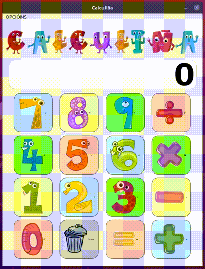

# TAREFA DO MÓDULO DESENVOLVEMENTO DE INTERFACES
# NOME DO PROXECTO: CALCULIÑA

A aplicación, escrita en *Python*, é unha calculadora infantil que realiza as operacións aritéticas básicas.

Nela se amosa unha ventana principal cunha pantalla onde amosarán os resultados e unha serie de botóns numéricos, operacións aritméticas, botón de resutado e borrar.
Asimesmo ten un pequeno menú superior con acceso a borrado da pantalla, manual técnico da aplicación e información básica sobre a mesma.

Si se quere saír da aplicación, dende o menú ou na aspa da ventana principal, aparecerá unha ventana de diálogo para confirmar a decisión.

## EXPLICACIÓN DO PROXECTO
O proxecto está dividido en varios ficheiros. Os principais: o programa principal da aplicación *calculadora_infantil.py* e *infoVentanaAp.py* para xerar a ventana de información sobre a aplicación.

Adicionalmente, os ficheiros, con extensión *ui* das ventanas creadas en *QT Designer* foron convertidas a *Python* nos ficheiros: *calculinhaWindow.py* e *info_ventana.py*.

Temos tamén o módulo: *novo_boton.py* que é unha clase que hereda de QPushButton para xerar os botóns da calculadora.

O módulo *ventana_pdf.py* usarémolo para xerar a ventana que amosará o pdf do manual da aplicación.

As imaxes utilizadas na aplicación, os números dos botóns, están ubicadas na carpeta *imaxes*.

## CLONAR O PROXECTO EN LOCAL
[Repositorio en gitlab]URL https://gitlab.com/mpacior/dint-dam-20-21/a20miguellp/-/tree/master/a20miguellp-UD5-PR5

## REQUISITOS PARA PODER EXECUTAR A APLICACIÓN
* Intérprete de Python
* Libraría gráfica Pyside2

Para executar a aplicación basta facer doble clic no ficheiro ou,
 dende a liña de comandos da consola ou terminal *python calculadora_infantil.py*

## DOCUMENTACIÓN TÉCNICA DO PROXECTO
Instalar o tema: *pip install zerovm-sphinx-theme*

Modificar/engadir as seguintes liñas en: /doc/conf.py
- import zerovm_sphinx_theme
- html_theme = 'zerovm'
- html_theme_path = [zerovm_sphinx_theme.theme_path]

Pódese acceder a unha versión html da documentación na seguinte ubicación:
URL https://gitlab.com/mpacior/dint-dam-20-21/a20miguellp/-/tree/master/a20miguellp-UD5-PR5/doc/build/html

Versión en pdf: URL https://gitlab.com/mpacior/dint-dam-20-21/a20miguellp/-/tree/master/a20miguellp-UD5-PR5/doc/calculinha.pdf

