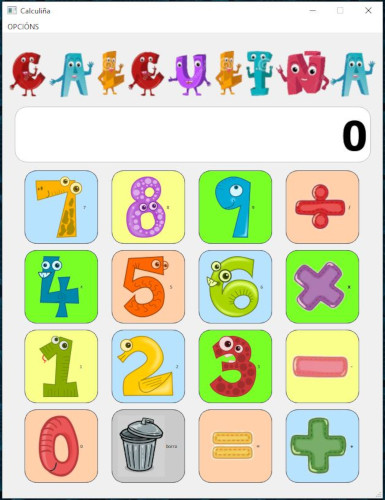

Calculiña
=========

Recursos necesarios
-------------------

- Documentación oficial Python:
  https://docs.python.org/es/3/

- PySide2 (Qt 5 sobre Python):
  https://doc.qt.io/qtforpython-5/contents.html

- Documentación de proxectos Python con Sphinx:
  https://www.sphinx-doc.org/en/master/

- Guía para a sintaxe markdown: 
  https://www.markdownguide.org/basic-syntax/

Instalación das dependencias
----------------------------

En Linux xa temos o intérprete de Python no sistema. 

Pero en Windows é necesaria a instalación. 

- Descargar https://www.python.org/ftp/python/3.9.4/python-3.9.4-amd64.exe

 e instalar como administrador.

Instalar tamén a seguinte dependencia en Linux:

``sudo apt-get install python3 python3-pip``

En Windows seguir as instruccións: 

https://recursospython.com/guias-y-manuales/instalacion-y-utilizacion-de-pip-en-windows-linux-y-os-x/

Execución da aplicación
-----------------------

``python calculadora_infantil.py``

Xerar a documentación
---------------------

1. Inicialmente haberá que instalar o paquete correspondente:
   ``pip install zerovm-sphinx-theme``

2. Crear unha carpeta doc e situarse nela e executar ``sphinx-quickstart``

3. Modificar/engadir as seguintes liñas en /doc/conf.py:

   ``import zerovm_sphinx_theme``

   ``html_theme = 'zerovm'``

   ``html_theme_path = [zerovm_sphinx_theme.theme_path]``

4. Engadir as extensións en /doc/conf.py:   

    [ "sphinx.ext.intersphinx",

    "sphinx.ext.autodoc",

    "sphinx.ext.mathjax",

    "sphinx.ext.viewcode",]

5. Xerar os documentos REST:
   ``sphinx-apidoc -f -M -o source/api/ ../..``

6. Xerar ``README.rst`` e ``index.rst`` 

7. Xerar a documentación (en Windows usar ``.\make``):
   HTML: ``make html``
   PDF: ``make latexpdf``

Os resultados atoparanse en:

- ``/doc/build/html`` e en ``/doc/build/latexpdf``

Se fose necesario desfacer o realizado executar: 

- Terminal Linux: ``make clean`` 

- Consola Windows: ``.\make clean``

